# next-o2shop

> **Learning Project** — This is a personal pet project built for learning purposes only. It is not intended for production use.

A full-stack e-commerce clone (storefront + admin panel) built to practice production-grade Next.js patterns: App Router with a strict RSC/Client Component split, HttpOnly-cookie JWT auth with silent refresh, role-gated admin access, and Stripe payments. Connects to the companion [nest-o2shop](../nest-o2shop) NestJS backend API.

---

## How it works

**Customer flow**

1. Browse the catalog (`/products`, filters + pagination) and product detail pages (gallery, variant picker, reviews) — no login required.
2. Add to cart; proceed through checkout: information (address) → shipping method → Stripe payment → confirmation.
3. `/account` and order history are gated by `middleware.ts` — unauthenticated visitors are bounced through `/auth/refresh` (silent token refresh) and on to `/login` if that fails.
4. Logged-in customers manage saved addresses and view order detail under `/account`.

**Admin flow**

1. Log in with an account whose JWT `role` claim is `admin`.
2. `middleware.ts` allows `/admin/*` only when `role === "admin"`; anyone else is redirected to `/`.
3. From the admin dashboard: manage products (with a variant dialog for color/size), categories, collections, orders (fulfillment status), users, shipping methods, review moderation, and an audit log ("changes" feed).

---

## Technology Stack

| Layer | Technology |
|---|---|
| Framework | Next.js 16 (App Router) |
| Language | TypeScript 5 |
| Styling | Tailwind CSS v4 |
| UI Components | Shadcn/ui, Base UI, Radix UI |
| HTTP Client | Axios |
| Forms | React Hook Form + Zod |
| Tables | TanStack Table v8 |
| Payments | Stripe |
| Icons | Lucide React |
| Runtime | React 19 |

---

## Screenshots

**Storefront**
| Home | All Products |
|---|---|
| 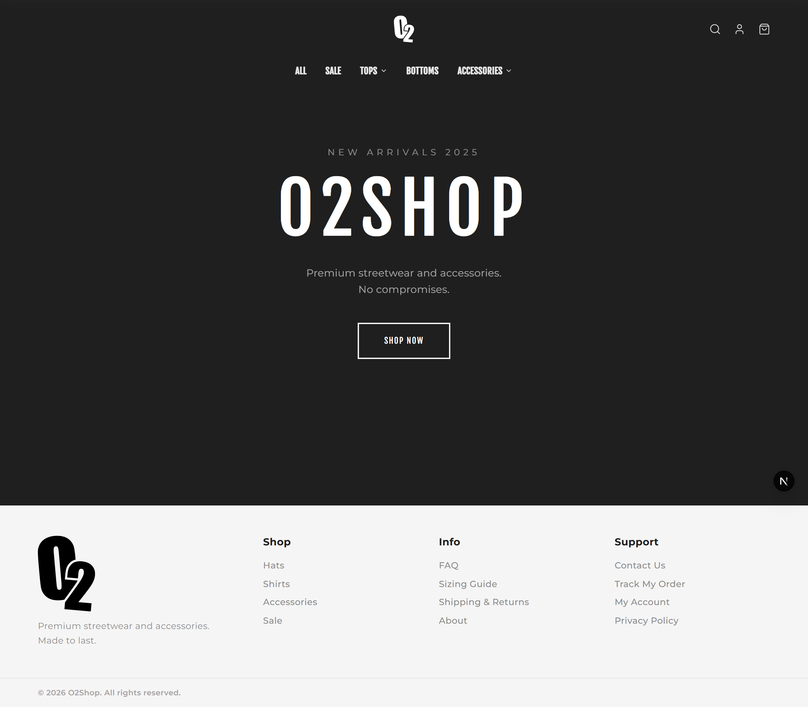 | 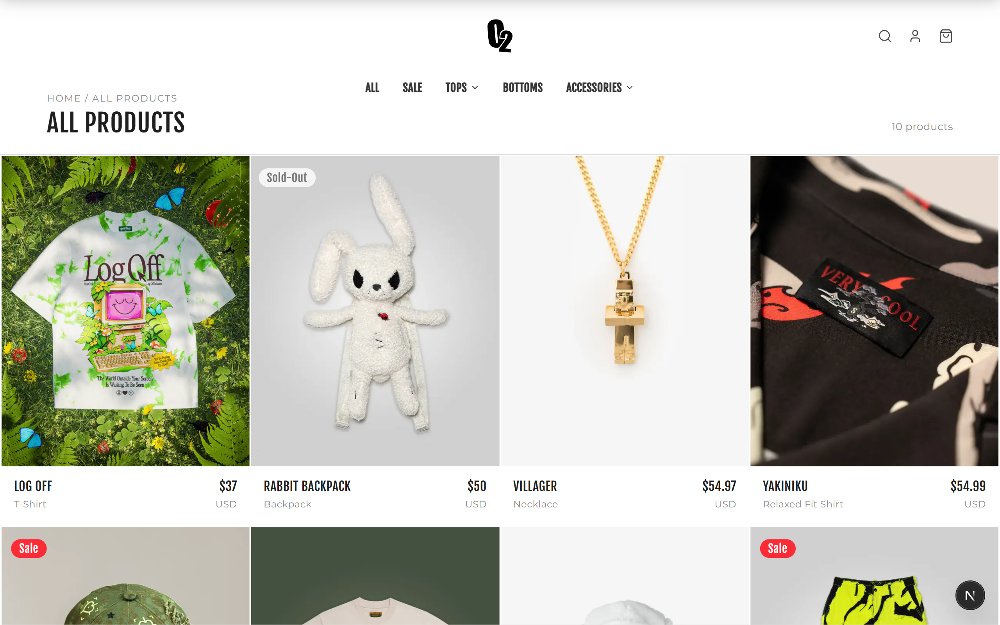 |

| Product Detail | Cart |
|---|---|
| 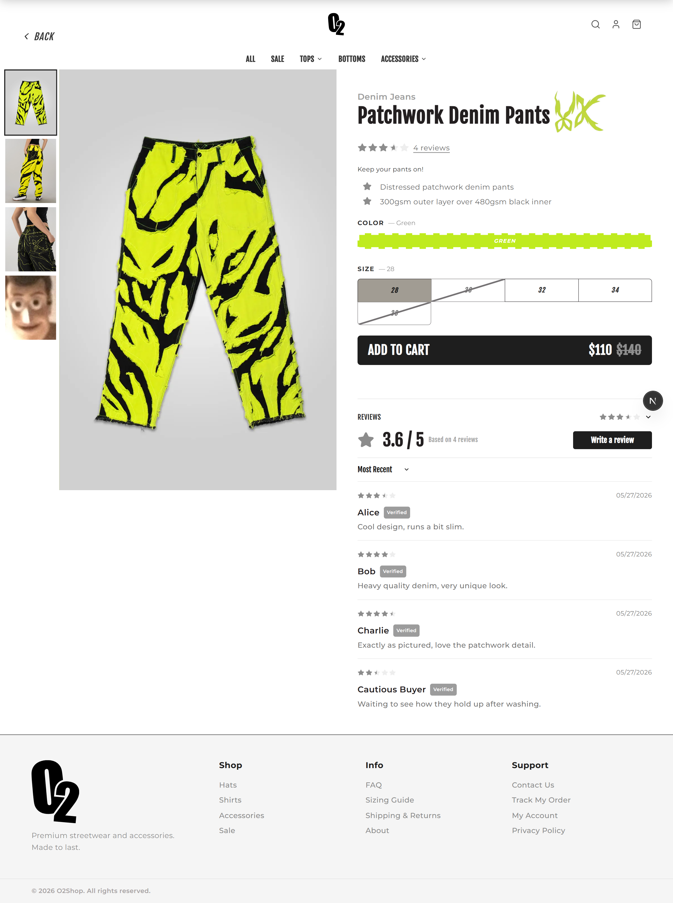 | 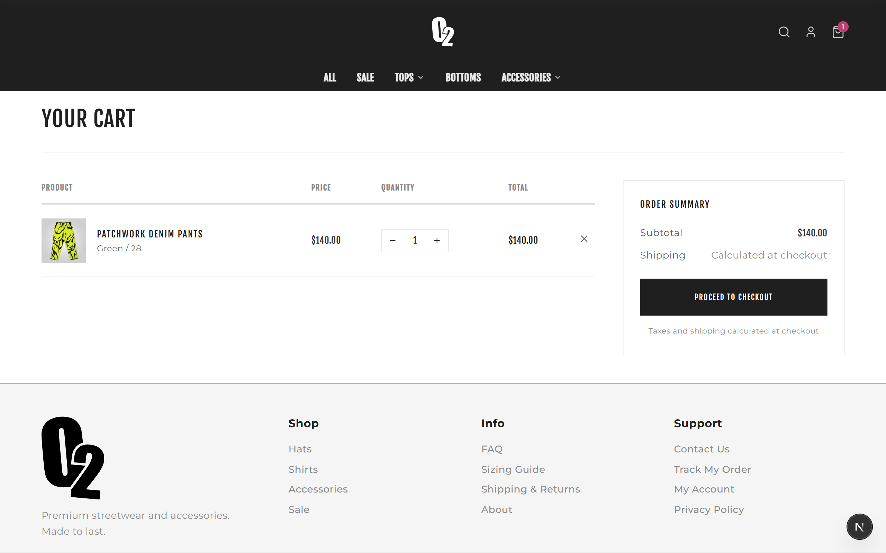 |

**Checkout**

| Information | Shipping Method |
|---|---|
| 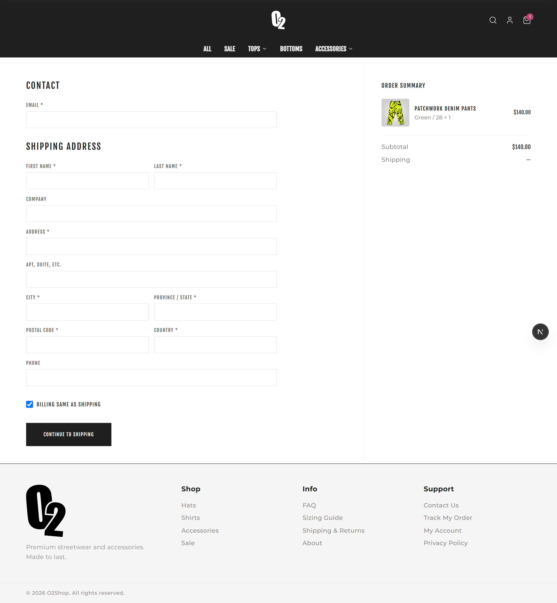 | 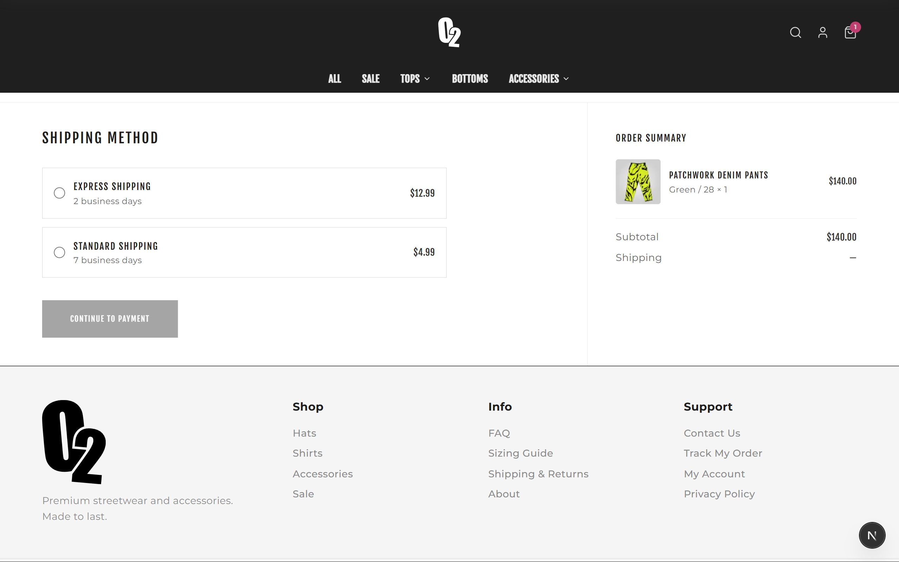 |

| Payment | Confirmation |
|---|---|
| 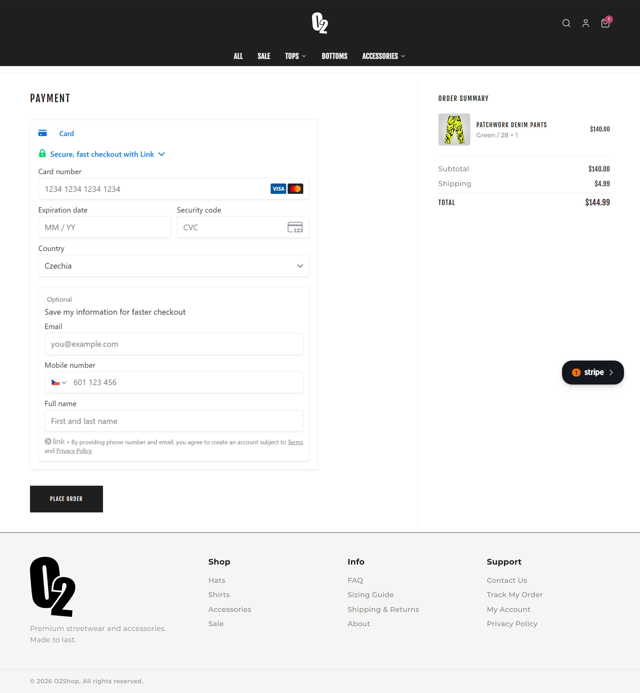 | 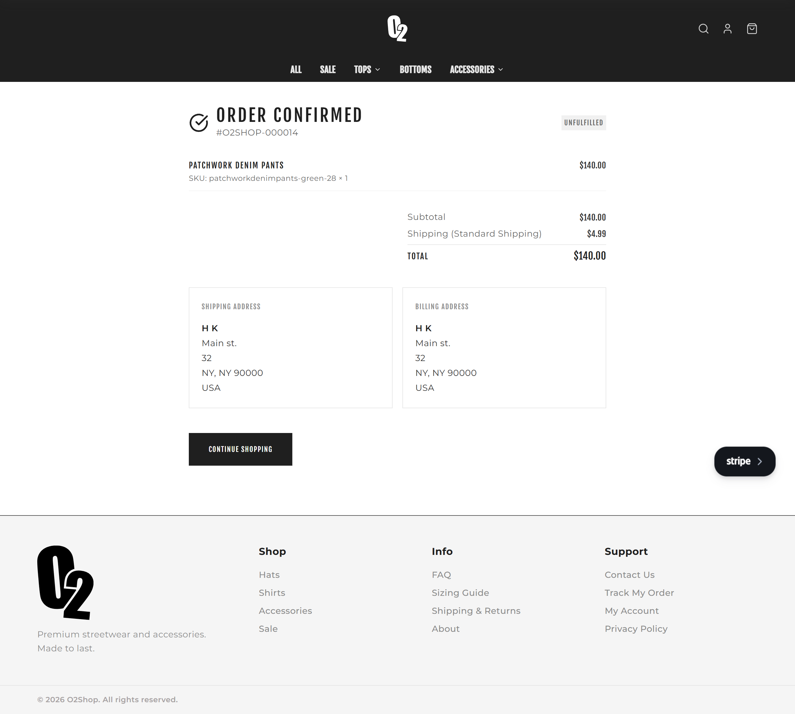 |

**Account**

| Login | Order Detail |
|---|---|
| 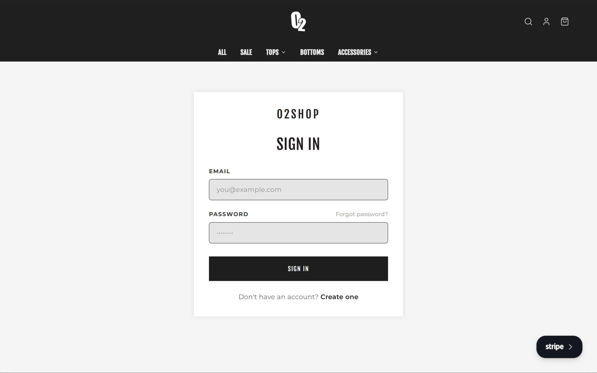 | 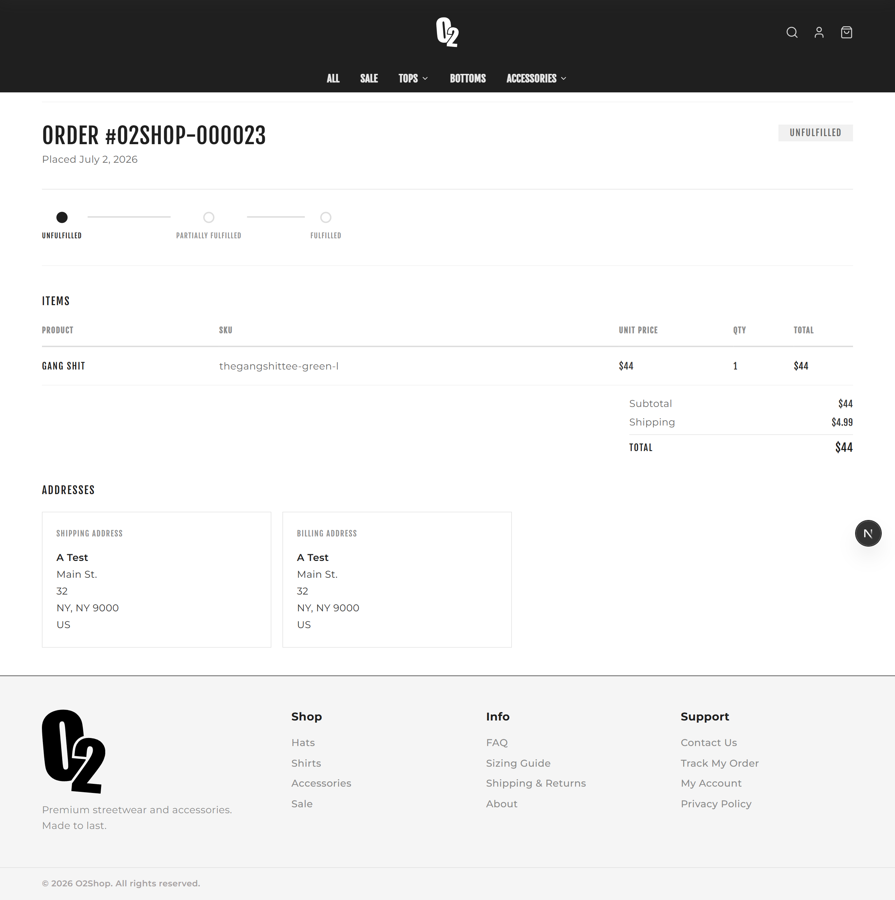 |

**Admin**

| Products | Orders |
|---|---|
| 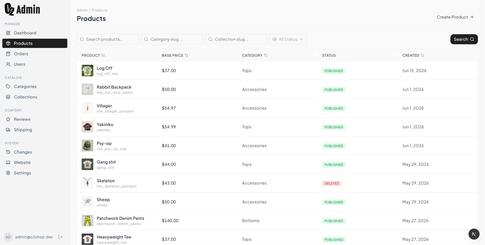 | 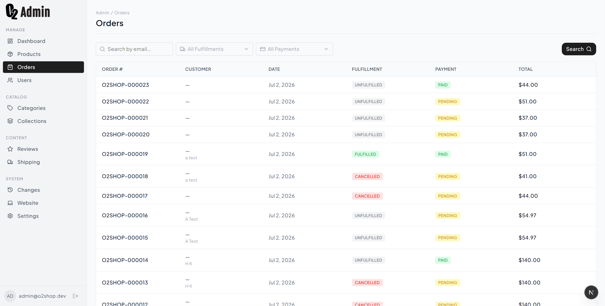 |

| Reviews | Changes History |
|---|---|
| 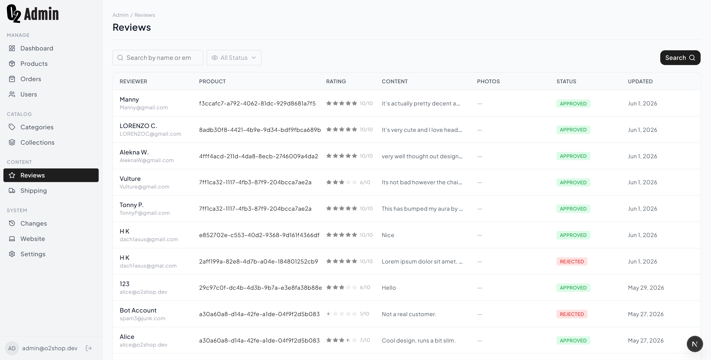 | 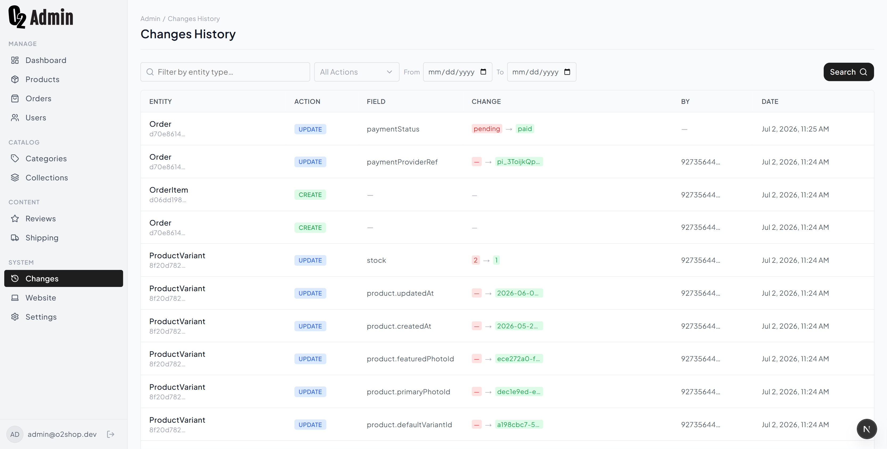 |

## Architecture

One root layout (`app/layout.tsx`) wraps two route groups plus route handlers:

- **`(shop)`** — public storefront; no auth required except `/account`.
- **`(admin)/admin`** — internal admin panel; every route gated behind `role: "admin"` (see [How it works](#how-it-works)).
- **`auth/`** and **`api/`** — route handlers, not pages: token refresh proxy and Stripe PaymentIntent creation.

**Data fetching model:** Server Components fetch on the server via `serverApi`; Client Components handle mutations and interactive state via `clientApi`. The boundary is enforced at the module level (`server-only` / `client-only` imports) — see [API Layer](#api-layer).

**Access control:** centralized in one place, `middleware.ts`, rather than scattered per-page checks.

## Getting Started

### Prerequisites

- Node.js 20+
- The [nest-o2shop](../nest-o2shop) backend running locally on port 3001

### Installation

```bash
npm install
```

### Environment variables

Create `.env`:

```env
NEXT_PUBLIC_API_URL=http://localhost:3001
NEXT_PUBLIC_STRIPE_PUBLISHABLE_KEY=pk_test_...
```

### Development

```bash
npm run dev      # http://localhost:3000
npm run build    # Production build
npm run start    # Serve production build
npm run lint     # ESLint
```

## Project Structure

```
app/
  (shop)/                          — Customer storefront route group
    page.tsx                       — Home
    products/page.tsx              — Catalog (pagination, filters)
    products/[slug]/page.tsx       — Product detail (gallery, variants, reviews)
    cart/page.tsx                  — Cart
    checkout/information/page.tsx  — Step 1: address
    checkout/shipping/page.tsx     — Step 2: shipping method
    checkout/payment/page.tsx      — Step 3: Stripe payment
    checkout/confirmation/page.tsx — Step 4: confirmation
    account/page.tsx               — Order history + saved addresses
    account/orders/[id]/page.tsx   — Order detail
    login/page.tsx                 — Login
    register/page.tsx              — Register
  (admin)/admin/                   — Admin panel route group (role-gated, see How it works)
    page.tsx                       — Dashboard
    products/, categories/, collections/  — Catalog management CRUD
    orders/                        — Order management + fulfillment status
    users/                         — User management
    shipping/                      — Shipping method CRUD
    reviews/                       — Review moderation
    changes/                       — Audit log feed
  auth/refresh/route.ts            — Silent token refresh (GET redirect flow, POST for client interceptor)
  api/payments/create-intent/route.ts — Creates a Stripe PaymentIntent

components/
  layout/    — Navbar, Footer, global shell
  ui/        — Shared primitives (Button, Badge, StarRating, Skeleton…)
  products/  — ProductCard, VariantPicker, ReviewItem
  account/   — AddressCard, OrderStatusBadge, LogoutButton…
  admin/     — DataTable, AdminSidebar, FilterBar, FormCard…

lib/
  api/         — Axios instances + domain service modules (see API Layer)
  admin/       — Admin-specific formatters and param parsers
  types.ts     — Shared TypeScript types (Product, Order, Review…)
  utils.ts     — Utility helpers (cn, etc.)
  nav-config.ts

specs/         — Design reference files (not part of the app)
```

## API Layer

All HTTP calls go through Axios — never use `fetch` directly.

**Two Axios instances:**

| Instance | File | Use in |
|---|---|---|
| `serverApi` | `lib/api/server.ts` | RSC pages, Server Actions |
| `clientApi` | `lib/api/client.ts` | Client Components (mutations) |

`serverApi` reads `access_token` from HttpOnly cookies via `next/headers` and attaches `Authorization: Bearer`. `clientApi` uses `withCredentials: true` and includes a 401 → silent refresh → retry interceptor; on refresh failure it redirects to `/login`.

**Domain service modules:**

| File | Endpoints |
|---|---|
| `auth.ts` / `auth-client.ts` | login, register, logout, refresh, `/me` |
| `products.ts` | paginated product list (filters), product by slug |
| `categories.ts` | category list, category by id |
| `reviews.ts` / `reviews-server.ts` | reviews by product, delete review |
| `orders.ts` | `/me/orders`, `/orders/{orderNumber}` |
| `addresses.ts` / `addresses-server.ts` | list, create, update, delete saved addresses |
| `cart.ts` | stub (cart endpoint not yet in API) |
| `admin-*` | admin CRUD for products, users, orders, categories, collections, reviews, shipping, audit log |

**Error handling:** `lib/api/errors.ts` normalises all errors into typed subclasses: `AuthError`, `NotFoundError`, `ValidationError`, `ForbiddenError`, `ApiError`. In RSC pages: catch `NotFoundError` → `notFound()`, catch `AuthError` → `redirect('/login')`.

**Key gotchas:**
- `GET /orders/{orderNumber}` takes the display string (e.g. `ORD-20240101-0001`), not a UUID
- `GET /products/{productId}/reviews` takes the product UUID, not the slug — fetch the product first
- `cookies()` from `next/headers` is async in Next.js 15+ — always `await` it

## Design System

All visual tokens are defined as CSS custom properties in `app/globals.css` and exposed as Tailwind utilities via `@theme inline`. Never hardcode hex values or arbitrary spacing.

| Token group | Examples |
|---|---|
| Colors | `bg-accent`, `text-foreground-subtle`, `border-border` |
| Typography | `--font-primary` (Fjalla One), `--font-secondary` (Montserrat) |
| Spacing | `--space-1` through `--space-15` |
| Border radius | `rounded-pill`, `rounded-md`, `rounded-sm` |
| Shadows | `shadow-0` through `shadow-4` |
| Motion | `--transition-fast`, `--transition-base`, `--transition-slow` |
| Layout | `--header-height-desktop/mobile`, `--cart-drawer-width`, `--checkout-max-width` |

## Key Features

**Storefront**
- Product catalog with pagination, category/collection filtering
- Product detail with photo gallery, color/size variant picker, and customer reviews
- Multi-step checkout: address → shipping method selection → Stripe payment → confirmation
- Customer account: order history with detail view, saved address CRUD

**Admin Panel** (`/admin`)
- Product management: create/edit with variant dialog, rich description editor
- Order management with fulfillment status tracking
- User management
- Category, collection, and shipping method CRUD
- Review moderation
- Audit log (changes feed)

**Infrastructure**
- HttpOnly cookie auth with silent token refresh on 401
- Server-side data fetching in RSC pages; client mutations via `clientApi`
- Stripe integration for payment processing

## Auth Flow

1. `POST /auth/login` — backend sets `access_token` + `refresh_token` as HttpOnly cookies
2. `serverApi` reads `access_token` cookie server-side and forwards as `Authorization: Bearer`
3. `clientApi` sends cookies via `withCredentials: true`; on 401 it calls `/auth/refresh`, retries once, then redirects to `/login`
4. The frontend never reads or stores tokens directly

## Backend

The companion backend is [nest-o2shop](../nest-o2shop) (NestJS). Its live OpenAPI schema is at `../nest-o2shop/specs/openapi.json` — re-read this file whenever working on API integration, as the backend is actively developed.
